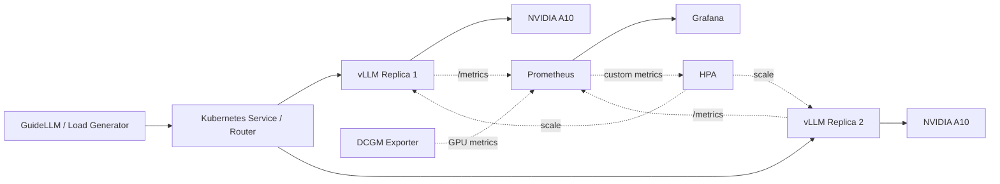

# vLLM 大模型推理服务性能与弹性优化

> A reproducible Kubernetes-native lab for vLLM serving, performance analysis, observability, and elastic scaling.

本项目面向 AI Infra / 推理基础设施场景，基于 Kubernetes、vLLM 与 Qwen3-8B 构建 OpenAI 兼容推理服务，并通过可复现实验分析并发负载、上下文长度和引擎参数对 TTFT、TPOT、吞吐量、P95 延迟、KV Cache 与 GPU 利用率的影响。

## 项目定位

项目聚焦推理数据面，不把 GPU 虚拟化或 HAMi 作为主线：

- 推理服务工程化：模型挂载、健康检查、服务暴露和故障恢复。
- 性能分析：建立固定负载、参数矩阵和重复实验方法。
- 可观测性：关联 vLLM 请求指标与 NVIDIA GPU 指标。
- 弹性优化：验证多副本服务与基于请求队列的扩缩容策略。

非目标：模型训练、微调、RAG 应用开发，以及自研 vLLM 内部算法。

## 计划架构

## 三个核心模块

### 1. 推理服务工程化

- 在 Kubernetes 上部署 Qwen3-8B 与 vLLM OpenAI-compatible server。
- 配置模型权重挂载、Service、startup/readiness/liveness probe。
- 固化 `max-model-len`、`max-num-seqs`、`gpu-memory-utilization` 等参数。
- 记录启动时间、模型加载失败和显存不足等故障边界。

### 2. 性能分析与参数优化

- 使用 GuideLLM 或 vLLM benchmark 构造固定 Token 长度和并发负载。
- 采集 TTFT、TPOT、端到端延迟、P95/P99、requests/s 与 tokens/s。
- 采用预热、重复运行和中位数汇总，保证实验可复现。
- 分析 Continuous Batching、KV Cache 容量和请求排队之间的关系。

### 3. 可观测性与弹性

- 接入 Prometheus、Grafana 与 NVIDIA DCGM Exporter。
- 关联请求队列、KV Cache、GPU 利用率、显存与功耗指标。
- 构造突发流量，验证基于 waiting requests 的 HPA 扩缩容。
- 测量扩容触发时间、Pod Ready 时间、冷启动和扩容期间尾延迟。

## 当前环境资产

- Kubernetes v1.28.15，双节点集群。
- NVIDIA A10 GPU，每张约 23 GiB 显存。
- 本地 Qwen3-8B BF16 权重。
- vLLM 0.9.1、PyTorch 2.7.0+cu126。
- 集群已有 Prometheus、Grafana、ServiceMonitor CRD 与 DCGM Exporter。

以上仅描述已盘点的环境；部署清单、实验结果和性能结论将在实际完成后更新。

## 仓库结构

~~~text
vllm-infra-lab/
├── deploy/kubernetes/   # Namespace、Deployment、Service 与持久化声明
├── benchmark/
│   ├── scenarios/       # 可版本化的压测负载定义
│   ├── run_benchmark.py # 压测入口（Phase 2 实现）
│   └── aggregate_results.py
├── monitoring/          # ServiceMonitor、PrometheusRule 与 Grafana Dashboard
├── analysis/            # 指标关联与绘图脚本
├── scripts/             # 部署、冒烟测试与环境元数据采集
├── results/             # 经脱敏的原始结果、汇总数据和图表
└── docs/                # 架构、实验方法、Runbook 和性能报告
~~~

当前仓库按 Phase 1–4 逐步实施，不额外引入会冲淡 AI Infra 主线的前端、业务后端或数据库。项目从定位、环境盘点到每次部署、故障和实验复盘的完整记录见 [docs/PROJECT_JOURNAL.md](docs/PROJECT_JOURNAL.md)。

## 路线图

- [x] 盘点硬件、集群、模型和现有运行环境
- [x] 建立可重复部署的单副本 vLLM 基线
- [ ] 完成并发与请求长度基准测试（并发 1/2/4 已完成）
- [ ] 完成 vLLM 与 GPU 可观测性（ServiceMonitor 已接入，Dashboard 待完成）
- [ ] 完成关键引擎参数对照实验
- [ ] 完成多副本与弹性扩缩容实验
- [ ] 固化结果、复现步骤与简历数据

详细方案见 [docs/PROJECT_PLAN.md](docs/PROJECT_PLAN.md)，实验设计见 [docs/EXPERIMENTS.md](docs/EXPERIMENTS.md)。

## 上游参考

- [vLLM](https://github.com/vllm-project/vllm)
- [vLLM Production Stack](https://github.com/vllm-project/production-stack)
- [GuideLLM](https://github.com/vllm-project/guidellm)
- [NVIDIA DCGM Exporter](https://github.com/NVIDIA/dcgm-exporter)

## License

[MIT](LICENSE)
