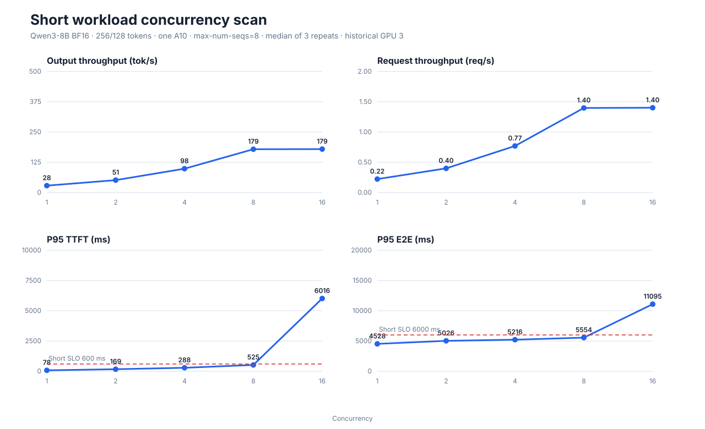
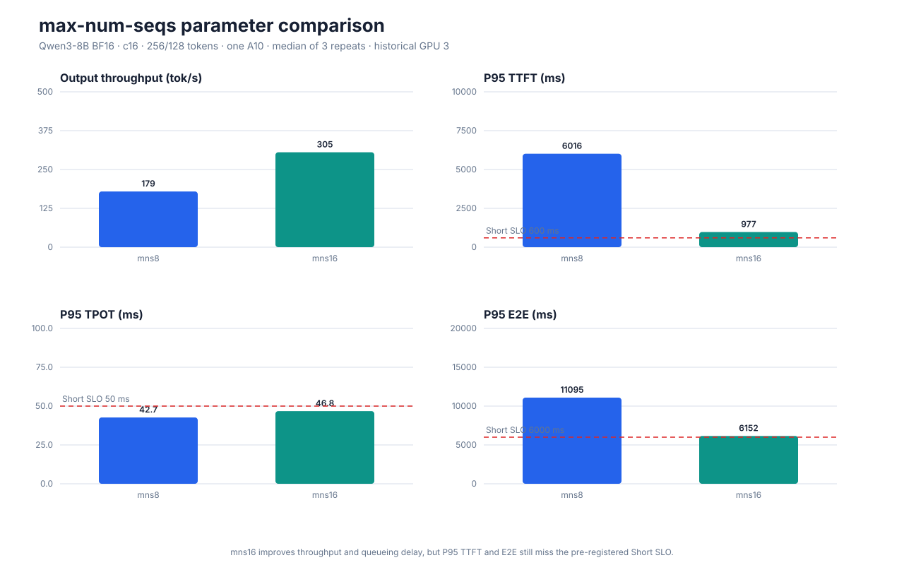
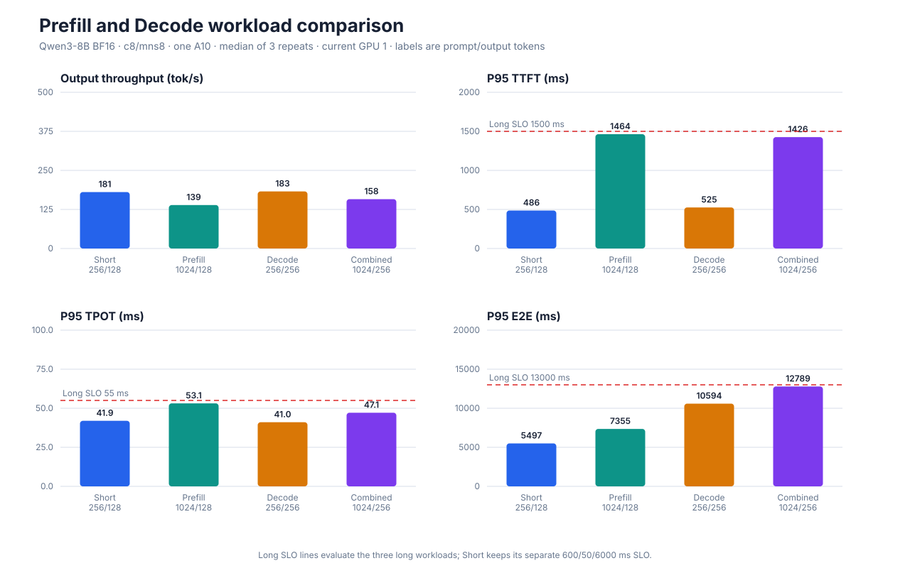

# Analysis

本目录在 Phase 2 存放结果校验、统计与绘图逻辑。分析脚本只读取脱敏后的实验元数据、客户端结果和 Prometheus 导出数据，不直接依赖集群凭据。

## Phase 2 性能图

`generate_charts.py` 使用 Python 标准库读取已提交的 `aggregate.json`，验证场景和并发身份后生成 SVG，不需要 Matplotlib、浏览器或集群访问权限。新格式结果还会验证 `max-num-seqs`；早期 c1–c16 聚合格式没有 `server.engine`，其 mns8 身份来自当时的版本化 Deployment 和实验 README，脚本不会伪造缺失字段：

```bash
python analysis/generate_charts.py
```

输出位于 `analysis/generated/`：

- `concurrency-scan.svg`：历史物理 GPU 3 上的 Short c1/2/4/8/16 吞吐与 P95 曲线；
- `max-num-seqs-comparison.svg`：固定 c16 时 mns8 与 mns16 的参数对照；
- `workload-comparison.svg`：当前物理 GPU 1 上 Short、Prefill、Decode 和组合长上下文对照。

脚本统一使用三轮聚合中位数。前两张图使用历史 GPU 3 数据，第三张图使用 Pod 重建后的当前 GPU 1 数据；不同物理 GPU 的结果不混在同一个控制变量结论中。







后续图表：

- waiting requests、KV Cache 与 GPU 利用率时间线；
- 扩缩容期间副本数、P95 和错误率时间线。
