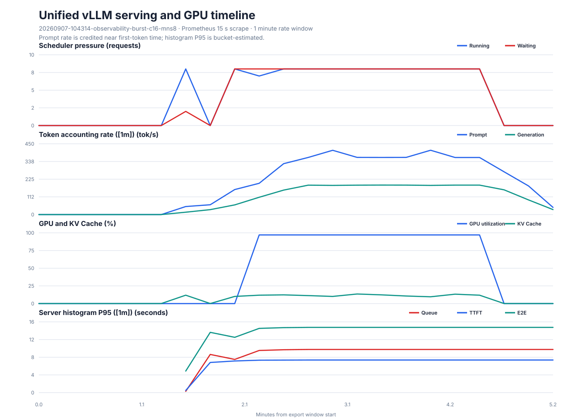

# Phase 3 统一时间线：c16-mns8

## 实验目的

本轮不是新的性能基线，而是在 Phase 2 已知会排队的单副本 `c16-mns8` 条件下，用一次持续负载关联 vLLM scheduler、KV Cache、服务端 histogram 与 DCGM GPU 指标。正式负载为 256/128 Token、客户端并发 16、服务端 `max-num-seqs=8`、240 个请求、1 轮；单轮设计用于控制共享公司 GPU 占用，不能替代三轮性能基线。

实验使用物理 GPU 1（`GPU-5e5590e5-51de-1c1c-6c72-4cbe1477e116`），只涉及现有单副本，不使用第二张 GPU，也没有修改公司服务。

## 客户端结果

| 指标 | 结果 | Short SLO v1 |
| --- | ---: | --- |
| 成功请求 | 240/240 | 通过 |
| 请求吞吐 | 1.460 req/s | — |
| 输出吞吐 | 186.868 tok/s | — |
| 总 Token 吞吐 | 560.603 tok/s | — |
| P95 TTFT | 5934.10 ms | 失败（≤600 ms） |
| P95 TPOT | 42.43 ms | 通过（≤50 ms） |
| P95 E2E | 10983.89 ms | 失败（≤6000 ms） |

结果与历史 c16-mns8 的吞吐平台和排队现象一致。SLO 仍以客户端逐请求分布判断，Prometheus histogram 不替代客户端精确分位数。

## 统一时间线结果

| 指标 | 观测结果 |
| --- | ---: |
| Running requests 峰值 | 8 |
| Waiting requests 峰值 | 8 |
| KV Cache 峰值 | 13.525% |
| Prompt 记账速率峰值 | 408.956 tok/s |
| Generation throughput 峰值 | 187.556 tok/s |
| GPU-Util 峰值 | 97% |
| GPU framebuffer used | 20212 MiB（整段窗口不变） |
| GPU 功耗峰值 | 150.457 W |
| GPU 温度峰值 | 70°C |

时间线显示：

1. 前置空闲阶段 `running=0、waiting=0、GPU-Util=0`。
2. 预热与正式负载进入后，scheduler 达到 `running=8、waiting=8`；这直接对应 `max-num-seqs=8` 的运行序列上限。
3. 稳态 Generation throughput 约 185–188 tok/s、GPU-Util 约 97%，而 KV Cache 峰值仅 13.525%。当前瓶颈不是 KV 容量耗尽，而是 mns8 限制下的排队和单卡计算资源竞争。
4. DCGM GPU-Util 相对 scheduler 曲线约晚一个 15 秒抓取点出现，说明跨 exporter 的单个对齐点可能存在抓取滞后，不能要求逐点严格同步。
5. 负载结束后 running、waiting、KV Cache 和 GPU-Util 恢复空闲；Token rate 与 histogram 仍保留一段尾迹，因为 PromQL 使用 `[1m]` rate 窗口。
6. DCGM framebuffer used 全程保持 20212 MiB，因为 vLLM 启动时已经预分配模型和 KV Cache 显存；它不能替代 `vllm:gpu_cache_usage_perc` 判断实时 KV block 占用。

## 运行后健康审计

- OpenAI API `/health` 正常。
- kube-state-metrics 显示 Pod `qwen3-8b-8fc88c5c9-5bmsd` 位于 `qhvgpu1`，Ready=1、Running=1、容器重启次数为 0。
- live Deployment 参数确认 `--max-model-len 4096`、`--max-num-seqs 8`、`--gpu-memory-utilization 0.85`。
- 本轮相邻 Prometheus 窗口内 `vllm:num_preemptions_total` 增量为 0。
- 客户端原始结果的失败数为 0。服务日志没有以 `ERROR`、`CRITICAL`、`FATAL` 或 `Traceback` 开头的真实错误记录。

最初使用不带日志级别锚点的 `error|fatal|exception` 检索产生了大量误报，因为 vLLM INFO access log 会完整记录随机 benchmark Prompt，而这些英文单词可能恰好出现在 Prompt 中。以后应优先筛选日志级别开头，并结合客户端 errors、preemption counter、Pod restart 和 API health 判断，不能把 Prompt 内容当成服务异常。

## Prometheus P95 的解释边界

服务端 `[1m]` histogram 峰值为 queue 9.75 s、TTFT 7.375 s、TPOT 48.96 ms、E2E 14.75 s。它们由 Prometheus 在有限 bucket 上插值得到，并且每个点混合最近一分钟内的请求；客户端 P95 则直接从本轮 240 条请求计算。因此两者适合分别用于运行时告警趋势与实验验收，不能要求数值完全相等，也不能混用来判定同一个 SLO。

## 数据完整性与复现

- `repeat-01.json`：vLLM 原始逐请求结果。
- `metadata.yaml`：Git commit、GPU UUID、场景和服务端控制变量。
- `aggregate.json`、`per-repeat.csv`、`summary.csv`：通过校验的客户端汇总。
- `monitoring/raw.json`：13 条 PromQL 的原始 matrix。
- `monitoring/timeline.csv`：15 秒步长的统一时间轴。
- `monitoring/metadata.json`、`monitoring/summary.json`：查询、时间边界和峰值摘要。
- `monitoring/timeline.svg`：由版本化脚本从 CSV 确定性生成。

导出器按实验目录时间提供前置 60 秒空闲窗口，并把 vLLM JSON 的 `date` 作为轮次完成时间，再增加后置 60 秒。`date` 不是轮次开始时间，不能再次叠加 `duration`。
