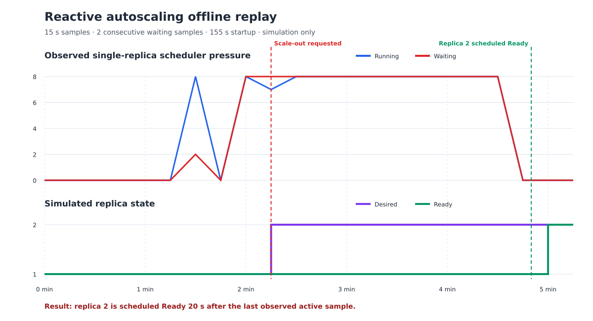

# Phase 4 弹性策略离线回放

输入是 Phase 3 已提交的单副本 c16-mns8 Prometheus/DCGM 统一时间线，策略为 waiting 连续两个 15 秒采样点后请求从 1 扩到 2，第二副本冷启动采用 Phase 4 实测的 155 秒。

## 关键事件

| 事件 | UTC 时间 |
| --- | --- |
| 首次 waiting（下一点恢复，未触发） | 2026-09-07 02:43:44 |
| 连续 waiting 开始 | 2026-09-07 02:44:14 |
| 请求扩容 | 2026-09-07 02:44:29 |
| 最后一个有负载的采样点 | 2026-09-07 02:46:44 |
| 第二副本计划 Ready | 2026-09-07 02:47:04 |
| 下一采样点观察到模拟 Ready | 2026-09-07 02:47:14 |

计划 Ready 时间比最后一个有负载的采样点晚约 20 秒。因此，在 `minReplicas=1` 的前提下，该纯反应式策略不能改善这次短突发已经发生的尾延迟。它适用于持续超过检测加冷启动时间的压力，或需要与预测预热结合。

缩容要求 waiting 为 0、running 不高于 4并持续 300 秒，同时第二副本 Ready 至少 300 秒。原始时间线在模拟 Ready 后只剩一个 15 秒间隔，所以本轮没有触发缩容；这不是缺失事件，而是防抖策略的预期结果。

该输出是离线状态机回放，不代表 Kubernetes 中实际发生过自动扩容，也不生成不存在的双副本性能数据。

